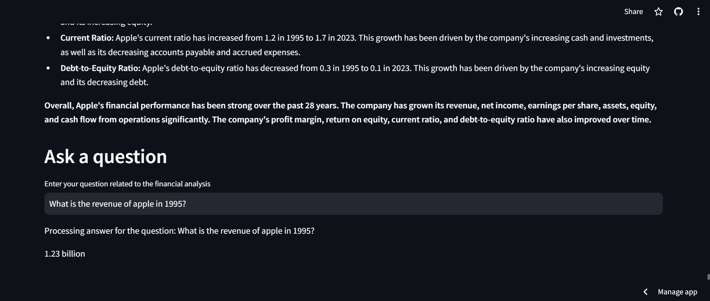

# Company-10K-Analyzer

This project is a financial data analysis dashboard built using Python, Streamlit, and related libraries to download, process, and visualize financial data from SEC 10k filings.

## Tech Stack

- **Python**: Chosen as the primary programming language due to its versatility, extensive libraries for data manipulation and visualization, and strong community support in the data science and web development domains.
  
- **Streamlit**: Selected for building the interactive web application due to its simplicity and ease of use for creating data-driven applications. Streamlit allows rapid prototyping and deployment of web apps directly from Python scripts.

- **Google Generative AI (Gemini API)**: AI model used for generating insights from financial data. The Gemini API from Google's Generative AI platform is utilized to analyze financial data and generate meaningful insights, providing valuable information for users and stakeholders.
Note: Replace `api_key` in the code with your own API key obtained from the Google Generative AI (Gemini) platform.

- **sec_edgar_downloader**: Utilized for fetching SEC filings (specifically 10-K reports) for a given ticker symbol. This library provides a convenient interface to access financial documents from the SEC's EDGAR database.

- **BeautifulSoup**: Used for HTML parsing to extract text content from SEC filings. BeautifulSoup facilitates the extraction of relevant financial information from the raw HTML of the filings.

- **Matplotlib**: Employed for generating financial visualizations such as line plots of key financial metrics over time. Matplotlib is a powerful plotting library that enables the creation of customizable and publication-quality charts.

- **Tabulate**: Used to format financial data into tables for display in the Streamlit application. Tabulate simplifies the process of presenting structured data in a readable tabular format.

## Project Overview

This project enables users to:

- Input a ticker symbol and date range to download corresponding 10-K filings from the SEC.
- Process the downloaded filings to extract key financial metrics such as revenue, net income, total assets, and total liabilities.
- Display the extracted financial data in a tabular format on a web page.
- Provide an interactive interface for users to ask questions related to the financial data and receive answers based on the processed information.
- Visualize the financial metrics over time using line plots for deeper analysis.


## How to Run

1. **Clone the Repository:**
   ```bash
   git clone https://github.com/akankshadhar2/Company-10K-Analyzer.git
   cd Company-10K-Analyzer
2. **Install Dependencies:**
   ```bash
   pip install -r requirements.txt
3. **Run the Streamlit App:**
   ```bash
   streamlit run app.py
4. **Access the Streamlit Dashboard:**
   Open a web browser and navigate to http://localhost:8501 to interact with the financial data analysis dashboard.

## Insights

- **Revenue Growth Trends**: Understand the revenue growth trajectory of the analyzed company over the specified period.
- **Net Income Fluctuations**: Analyze the fluctuations in net income to gauge profitability trends.
- **Total Assets and Liabilities**: Visualize changes in total assets and liabilities to assess financial stability.
  
## Why Care About These Insights?

These insights provide valuable information for investors, financial analysts, and stakeholders to make informed decisions:

- Revenue growth trends indicate business performance and market potential.
- Net income fluctuations reflect profitability and operational efficiency.
- Total assets and liabilities help assess financial health and risk exposure.

## Live Demo and Video Demo

Explore the live demo of the app [here](https://company-10k-analyzer.streamlit.app/).

Explore the video demo of the app [here](https://drive.google.com/file/d/1fc60fyt2ICgrCA_zJvlYn5HllCJhkViB/view?usp=sharing).

## Screenshots


*Screenshot: Download Successful and Generating Insights for AAPL from 1995 to 2023.*


*Screenshot: Financial Details for AAPL from 1995 to 2023.*


*Screenshot: Financial visualizations showing revenue, net income, total assets, and total liabilities over time for AAPL.*


*Screenshot: Full visualisation for AAPL from 1995 to 2023.*


*Screenshot: Financial Analysis and Insights for AAPL from 1995 to 2023.*


*Screenshot: Financial Analysis and Insights for AAPL from 1995 to 2023.*



*Screenshot: Ask a question for AAPL from 1995 to 2023.*

## Feedback

For any issues or feedback, please create a new issue [here](https://github.com/akankshadhar2/Company-10K-Analyzer/issues).


   
